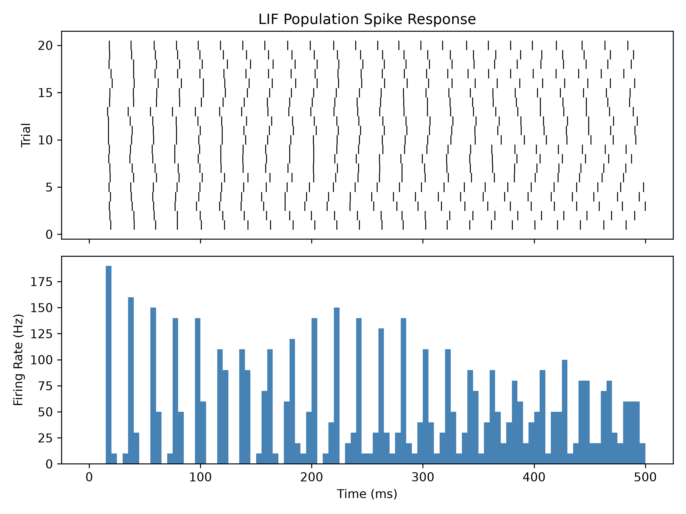
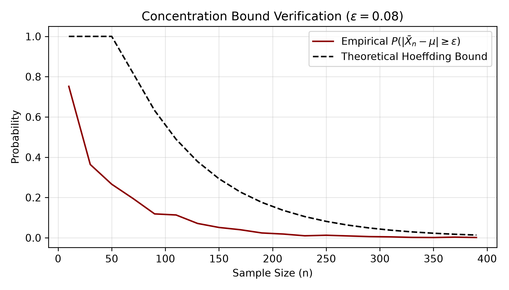

# Computational-neuro-toolkit

A modular Python package delivering numerical simulations for single-neuron dynamics, graph convolutional workflows, and empirical concentration bound verification.

---

## 1. Neural Spike Train Pipeline & Visualizer (`spike_pipeline.py`)
Simulates membrane potential dynamics $V(t)$ driven by stochastic current injections using numerical Euler integration of the Leaky Integrate-and-Fire (LIF) model:

$$\tau_m \frac{dV}{dt} = -(V(t) - V_{\text{rest}}) + R \cdot I(t)$$

Generates multi-trial raster plots aligned with a Peri-Stimulus Time Histogram (PSTH):

---

## 2. Graph Metric Pipeline (`graph_pipeline.py`)
Implements a 2-layer Spectral Graph Convolutional Network (GCN) evaluated on the Cora citation benchmark using PyTorch Geometric:

$$Z = \tilde{D}^{-1/2} \tilde{A} \tilde{D}^{-1/2} X W$$

- **Input:** 2,708 scientific publications with 1,433-dimensional word-indicator vectors.
- **Performance:** Reaches ~81% test accuracy on multi-class node classification.

---

## 3. Empirical Estimation of Statistical Bounds (`bounds_pipeline.py`)
Validates finite-sample deviation probabilities against theoretical Hoeffding concentration bounds:

$$P(|\bar{X}_n - \mu| \geq \epsilon) \leq 2 \exp(-2n\epsilon^2)$$

Simulates $M = 1,500$ Monte Carlo trajectories over varying sample horizons ($n \in [10, 400]$):

---

## Installation & Testing
git clone https://github.com//computational-neuro-toolkit.git
cd computational-neuro-toolkit
pip install -e .
pytest tests/
